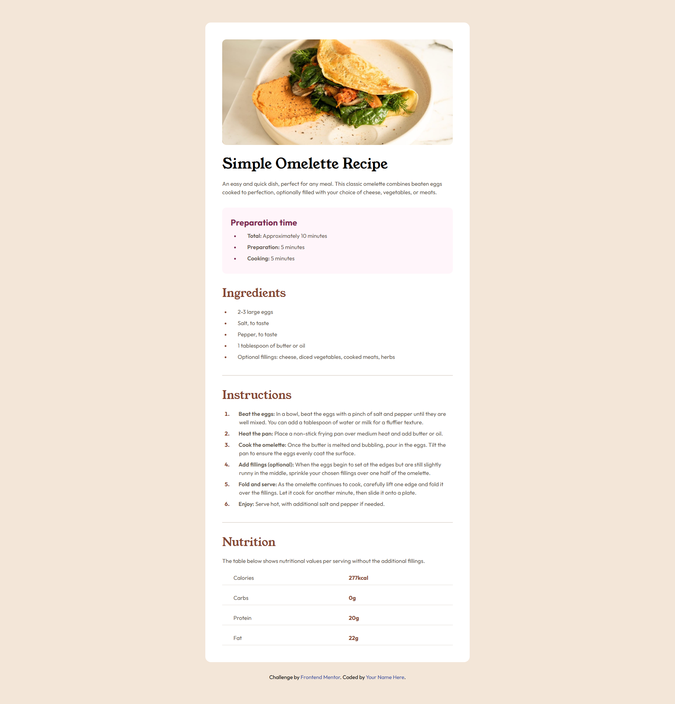

# Frontend Mentor - Recipe page solution

This is a solution to the [Recipe page challenge on Frontend Mentor](https://www.frontendmentor.io/challenges/recipe-page-KiTsR8QQKm). Frontend Mentor challenges help you improve your coding skills by building realistic projects. 

## Table of contents

- [Overview](#overview)
  - [The challenge](#the-challenge)
  - [Screenshot](#screenshot)
  - [Links](#links)
- [My process](#my-process)
  - [Built with](#built-with)
- [Author](#author)

## Overview

### Screenshot

### Links

- Solution URL: [GitHub](https://github.com/jdtb4/frontendmentor/tree/master/recipe-page-main)
- Live Site URL: [Vercel Site](https://recipe-page-pi-one.vercel.app/)

## My process

### Built with

- Semantic HTML5 markup
- CSS custom properties
- CSS Grid
- Mobile-first workflow

## Author

- GitHub - [Juan Trujillo](https://github.com/jdtb4/frontendmentor/tree/master/recipe-page-main)
- Frontend Mentor - [@jdtb4](https://www.frontendmentor.io/profile/jdtb4)